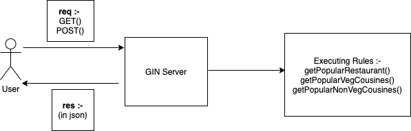
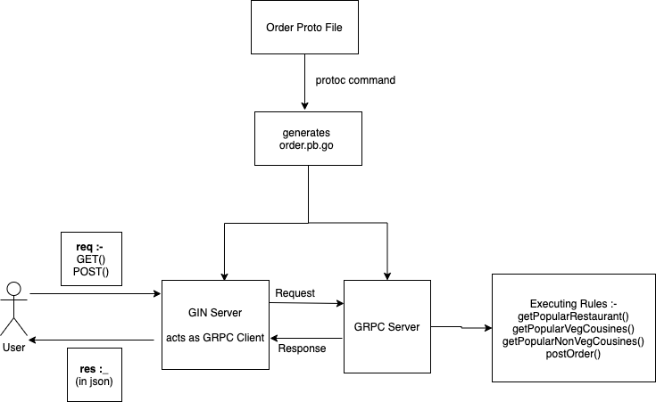

# consumer-order-prediction
repo for case study 1
 
## Overview of project :-
### Data to Information (phase -1) :-

 

 

### GIN Incorporation (phase-2) :-

 

 

### GRPC Incorporation (phase-3) :-

 

 

 
### To run this project, follow the below steps :-
1. Clone the repository
2. Change GOPATH to pwd to this repo i.e. consumer-order-prediction or just clone the repo in usr/local/go/src
3. To install GIN run the command, "go get -u "github.com/gin-gonic/gin"
4. TO install gRPC run the command "go get -u "google.golang.org/grpc"
5. In terminal go to consumer-order-prediction/pkg/grpc and run “go run server.go”
6. In another terminal go to cmd/gin_grpc and run “go run main.go”
7. After this the API will run on localhost:5656
 
### To fetch different queries try :
 
To fetch different query :-
* “Localhost:5656/” for homepage
* “Localhost:5656/popularrestaurant” to get popular restaurant
* “Localhost:5656/order” to place a new order
* “Localhost:5656/popularcuisine” to check the most popular cuisine
